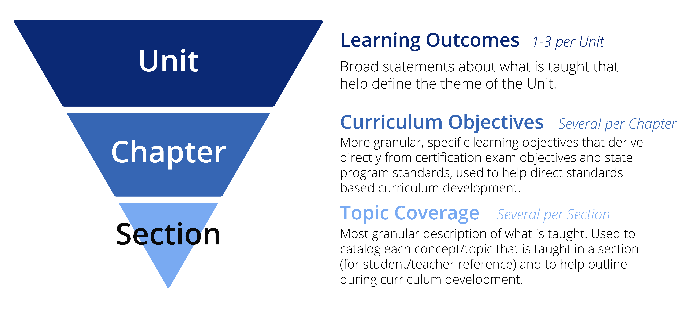
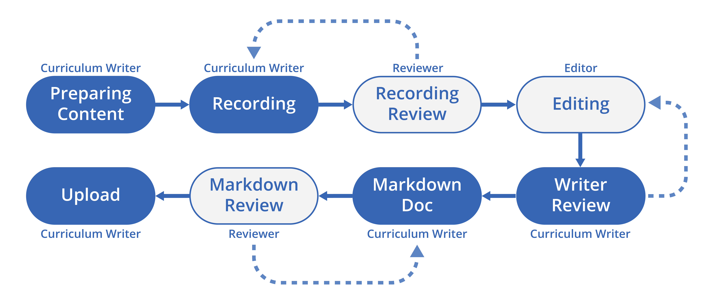

# Curriculum Development Docs

## Purpose

---

The purpose of this document is to outline the curriculum production process, define standards for curriculum materials, and provide easy access to curriculum production materials.


## Table of Contents

---

* [Course Structure](https://github.com/MasteryCoding/curriculum-development-documentation#course-structure)
  * [Unit](https://github.com/MasteryCoding/curriculum-development-documentation#unit)
  * [Chapter](https://github.com/MasteryCoding/curriculum-development-documentation#chapter)
  * [Section](https://github.com/MasteryCoding/curriculum-development-documentation#section)
* [Production Process](https://github.com/MasteryCoding/curriculum-development-documentation#production-process)
  * [Outline the Course](https://github.com/MasteryCoding/curriculum-development-documentation#outline-the-course)
  * [Building out a Unit](https://github.com/MasteryCoding/curriculum-development-documentation#building-out-a-unit)
  * [Writing a Video Section](https://github.com/MasteryCoding/curriculum-development-documentation#writing-a-video-section)
* [Material Standards](https://github.com/MasteryCoding/curriculum-development-documentation#material-standards)

## Course Structure

---

### Unit

* Each year-long course contains **8 Units**.
* Each semester is 4 Units long.
* Each Unit is approximately 20 45-minute Periods, or around 15 hours in length.
* Units must be self-contained and independent of one another, so that they may be updated independently.
* Units may build on the learning objectives of previous Units.
* A Unit may contain multiple small projects, build toward one larger project, or complete a self-contained part of an even larger project.

> If projects span across multiple Units, the project files for the partially-finished project must be provided at the beginning of the later Unit to ensure that they remain independent of one another.

### Chapter

* Each Unit has **3 to 6 Chapters**.
* Chapters may focus on a particular theme, complete a small project, or build a certain aspect/functionality of a larger project.

### Section

There are three form factors for sections: Document, Video, and Quiz.

| Form Factor | Description |
|----------   |-------------------------------|
| Document    |Made up of the [Lesson section](#lesson), which contains the main content of the section, and the [Resource Tabs](#resource-tabs)|
| Video       |Includes a video lecture along with written materials in the [Lesson section](#lesson) and [Resource Tabs](#resource-tabs).|
|Quiz         |Each question includes the question/prompt, a list of answers, an explanation of the answer, and a list of topics relating to the question.|

#### Graded Sections

There are 4 types of graded sections.

##### Quiz

* Length: 5-15 questions
* Format: All questions and choices are visible at once to the quiz taker.
* Purpose: To get students to recall the material they have explored. Questions should not be worded in a tricky way and wrong answers should be written with the intention of creating a learning moment where a student understands why the wrong answer was not correct (through the explanation).

##### Exam

* Length: 25+ questions
* Format: One question at a time, and a time limit can be set
* Purpose: To assess student understanding and help the instructor understand what questions students are getting confused about.

##### Activity

* Format: Instructions are provided for students complete to complete an activity from scratch or to finish something that was started in the video lecture. Smaller than projects. Can be either a stand alone section or a part of a strongly related section. May be either a Video or Document section.
* Purpose: For students to practice new concepts they learned and to assess students' ability to apply what they learned on their own.
* Submission: Possible formats include screenshot of a level, a C# script, a video of the project, a link to a Github repo, etc.
* Grading: Rubrics should be clear and simple and follow the [Activity Rubric Template]().

#### Project

* Format: Projects may span several sections (including follow along lectures), but the GRADED section should be a Document section ad the end of the project. Projects should always end with publishing to some platform (GitHub, CodePen, etc.).
* Purpose: To solidify learning and build students' portfolios.
* Submission: A teacher should be able to test the student's application as a whole to assess it.
* Grading: The rubric should assess the experience of the user, without requiring teachers to inspect the way it was built. Follow the [Project Rubric Template]().

> \* Rubric tip: anticipate common pitfalls students will make during the project and check for their symptoms in the rubric. (Example: A student didn't use a singleton so their HP and gold reset when the level changes.)

## Production Process



### Outline the Course

#### Define Learning Outcomes

Define a handful of broad **Learning Outcomes** for the course considering certification requirements, grade band, state program standards and writer's own subject area expertise.

Example Learning Outcomes:

* Understand the Unity Editor Interface
* Apply basic C# programming
* Be familiar with the game development process

#### Outline Units

Consider where in the course to cover each of the Learning Outcomes in depth, and arrange into the 8 Unit course structure. Based on this, determine the overarching theme for each Unit.

### Building out a Unit

Once the Units and their Learning Outcomes are established, writers focus on building one Unit at a time.

#### Gather Curriculum Objectives

**Curriculum Objectives** are specific, granular learning objectives that derive directly from certification exam objectives and state program standards. They are arranged by topic and subject area.

Curriculum writers scan through these existing Curriculum Objectives and compile a list of Objectives that should be covered in the Unit based on the theme and identified Learning Outcomes for the Unit.

#### Project Prototyping

Our courses are fundamentally meant to be **project-based**. This is a good stage to start considering what types of projects, either large or small, can be used to meet the outlined Curriculum Objectives.

Prototyping the project at this stage helps guide finer outlining in the following steps. Once a prototype is created and receives approval, it should be *added to a GitHub repository along with all necessary assets and a walk through document of the building process.* This will help aid in outlining the chapters and sections and planning the recording process as well as serve as a reference for teachers to gain an understanding of how the project was built.

Example project GitHub repo: [Roll-a-Ball-Walkthrough](https://github.com/jerazost/Roll-a-Ball-Walkthrough)

#### Outline Chapters

Arrange the chosen Curriculum Objectives for the Unit into a sequence that makes sense to teach and/or corresponds to the project build. Then, divide this sequence into Chapters based on subject matter or project build stage.

#### Outline Sections

Break the Chapters into Sections. Create a **Topic Coverage** list per section based on Curriculum Objectives and considering the subject being taught. The Topic Coverage is the most granular description of what students will be learning.

Every Chapter should have at least 1 graded assignment of any type. Activities and quizzes should be included periodically after new concepts or skills are introduced to reinforce learning.

### Writing a Video Section

#### Project Management and Organization

Each Section is made into its own task in Asana. This task is used to track the section through all stages of production including revisions.

Each section also has its own folder in the Curriculum Drive. The following belong in this folder:

* Lesson markdown document
* Slideshow presentation (optional)
* Video folder
  * Premier Pro File
  * Take folder
    * Clips from each take
* Resources sub-folder (optional)
  * Assets used in the lesson
  * .zip file of the project (in the state it is at the end of the lesson)

#### Process Overview



#### Outline and Preparing Content

The goal of this step is to prepare the materials associated with this section. This may include:

* Slideshow presentation (using Code Curriculum Template)
* Code/project segment that will be completed in this section

#### Record (Video Section Only)

* [OBS Setup Guide](https://docs.google.com/document/d/1d7Bp7jFai-5tFHV6SVDkVogqkaGm45p-WZ-0LilQ3T0/edit#): goes over all the settings and configurations to start recording using OBS.
* [MC Video Lesson Guide](https://docs.google.com/document/d/1UXkhZU9i0ksW2ojBpBKc39OqLGqr8Dw2UjskzSDM9SA/edit#): a comprehensive guide on how to start recording video, including rules and tips for recording and workflow optimization techniques.

Once a take is recorded, it is passed onto a reviewer. If approved, it will move onto editing, and if not, the writer records a subsequent take.

After recording is finished, the writer will include a .zip file of the project (in the state it is at the end of the lesson) in the Resources folder.

#### Editing

Videos always begin with the MC intro. Intro assets can be found [here](https://drive.google.com/drive/folders/1dsiglRZ1yhwXgURQCFF-V3kr62q-o_VV?usp=sharing).

#### Markdown

Once the edited video is approved by the course writer, the course writer creates a markdown document with all the necessary information. The video document template can be found [here](https://drive.google.com/file/d/10WsOKaPhTq-XfjSAo6lT09OF2JZQXVlD/view?usp=sharing).

### Preparing Front Facing Materials

After a Unit is finished, the course writier will provide a number of resources for the Marketing and Sales teams to use in sales enablement materials. 

#### Unit/Chapter Descriptions

Within each Unit, course writers provide a document with:

* Unit Summary: 2-3 sentenses listing clear student outcomes for the Unit. (What will students be able to do by the end of that Unit?) May also include short description of projects completed in the Unit.
* Chapter Summary: 1 sentense summary of student learning outcomes for the Chapter.

#### Project Samples

These materials will be placed in a folder named **Projects** located in the relevant Unit. Within this folder, each project will have its own sub-folder, named after the project, which should include:

* Project description document (paragraph with a summarizing the project, what it is and what it teaches)
* At least 1 video of the project
* At least 1 gif
* 2 or more still images
* Finihsed project files or assets used in the project

Provide a link to the project sub-folder in the [Student Projects/Curriculum Samples](https://docs.google.com/spreadsheets/d/1tM8de7fwsShPdjLeq4Jymjk4C-81cZIWBRvrgLedoNA/edit#gid=1245108391) spreadsheet.

## Material Standards

### Markdown Document

#### Lesson

Present on all document and video sections. In a Document section, this is the main body of the page. In a Video section, this is the portion below the video. Any information necessary to complete the section belongs in here, including any required reading or assignment instructions.

#### Vocabulary

A list of generic terms in key-value pair format where each item is defined, dictionary style. Links to sources are optional.

#### Documentation

A list of technology specific terms and tools used in the lecture with links to official documentation and a brief definition of the documented topic.

Example:

```md
**[out](https://docs.microsoft.com/en-us/dotnet/csharp/language-reference/keywords/out)**: A keyword used to pass an argument to a method by reference rather than by value.
```

#### Shortcuts

A list of keyboard shortcuts with context specified.

Example:

```md
#### Modifier Panel
  * <kbd>CTRL</kbd>+<kbd>A</kbd> = Apply Modifier
```

#### Resources

List of resources for the lesson including downloadable PDF/PowerPoint files of slideshow presentations, assets, external tools, etc.

#### Rubric

An embedded image of the project/assignment rubric and a download link for the rubric PDF.

#### Challenge


## Tips

---

### Slideshows

When writing slides ask, "how can the slides increase engagement or enhance understanding?"

Tips:

* If there are several points to make in a slide, use animations to make text and images appear as they are being discussed.
* Use visual aids to illustrate points.
* Maintain stylistic consistency.
* User colors that are not too loud. Favor muted colors that match the color theme.
* Think of slides as an enhancement or support to the delivery of the presentation, not as the core.

What to avoid:

* Using the slides as a script. The slides are not a script. They should complement and supplement the voiceover, not just repeat it.
* Too much text. Provide plenty of visual breathing room. Avoid dense, long walls of text and favor visual aids.
* Relying too much on the slides. Don't try to teach everything in the slides. There are many times when practical, in-application demonstrations convey information better than slides.

